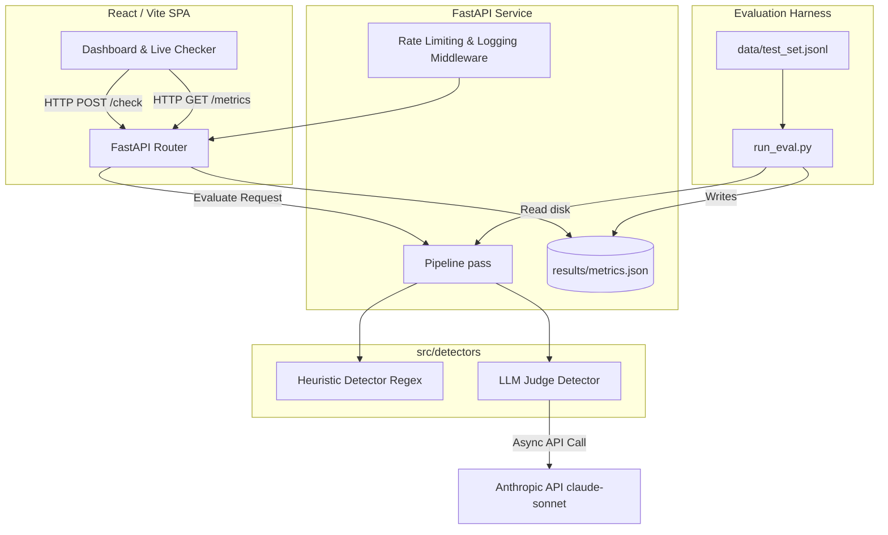

# Prompt Injection Guardrail Architecture

This document describes the architectural layout and production considerations for the full-stack Prompt Injection Guardrail project.

## Component Diagram

## Request Flow (`POST /check`)

1. **Client Request**: Frontend sends `POST /check` with a `content` payload.
2. **Middleware**: Rate limiter checks the IP. Logger starts timing.
3. **Pipeline Entry**: `pipeline.evaluate_content()` is invoked.
4. **Pass 1 (Heuristic)**:
   - Content is checked against multiple regex categories (e.g., direct overrides, roleplay).
   - If `confidence > 0.8`, the pipeline skips the LLM and immediately returns the result (cost optimization).
5. **Pass 2 (LLM Judge)**:
   - If heuristic confidence is below the threshold, the LLM Judge is invoked via `AsyncAnthropic`.
   - The judge uses a strict system prompt and enforces structured JSON output.
   - If the judge fails (e.g., missing API key), a graceful fallback verdict is returned, with an `error` flag set.
6. **Response**: FastAPI returns the `CheckResponse` payload including confidence, reasoning, triggered state, and latency back to the client.

## Production Gaps & Future Work

While this stack is demo-ready and handles the core pipeline securely, it contains several "honest" gaps before being considered true enterprise production infrastructure:

1. **Authentication & Multi-Tenancy**: The API currently lacks authentication; a production version would require API keys or JWTs to separate usage per tenant.
2. **Robust Rate Limiting**: The in-memory rate limiter will not synchronize across multiple Docker containers; we would need a Redis-backed token bucket.
3. **Observability & Persistent Storage**: Evaluation results are read from local disk, and logs are stdout-only. Production requires persisting requests to a database (e.g., PostgreSQL) and streaming logs to an aggregator (e.g., Datadog, ELK).
4. **Judge Resiliency**: The LLM path has a basic try/except fallback but lacks an exponential backoff circuit-breaker for handling extended third-party API outages safely.

## Deployment Strategy

The application can be deployed using the configurations in `deploy/`. 
- `render.yaml` allows deploying both the API and UI as separate services on Render. 
- `vercel.json` provides an optimized deployment path for the frontend on Vercel, assuming the API is hosted elsewhere. 
- **Important**: Ensure `ANTHROPIC_API_KEY` is provided as an environment variable to the API service only. Do not expose this to the frontend.
